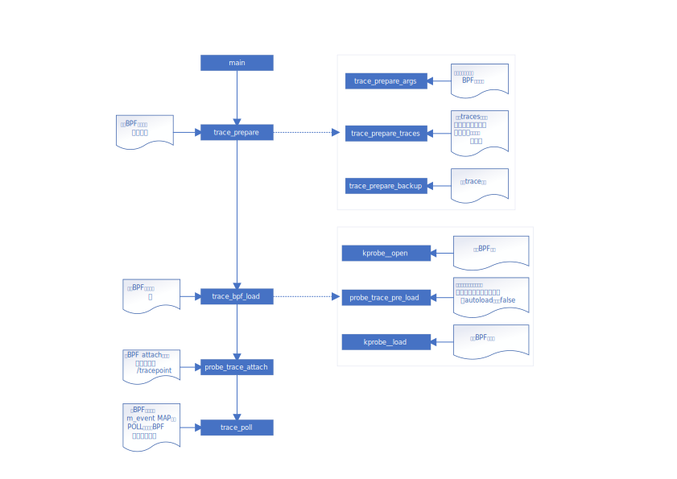

# 开发手册

## 一、项目结构介绍

### 1.1 文件夹

- component：组件模块，封装了一些通用的C函数

- docs：项目的文档目录

- legacy：老的基于BCC的nettrace，已遗弃

- nodetrace：节点报文跟踪模块

- script：项目构建过程中需要用到的一些脚本等

- shared：网络报文处理（用户态和BPF）用到的一些封装的相对较为通用的函数

  - bpf/sk_parse.h：封装的BPF程序相关的网络报文处理函数

  - bpf/vmlinux*：经过BTF生成的内核头文件，包含了内核中所使用到的所有的结构体

  - pkg_utils.c：封装的用户态使用的网络报文处理（解析、打印）函数

  - bpf_utils.c：封装的一些用户简化BPF程序处理的函数

- src：nettrace的核心代码

  - progs：BPF代码目录，其中kprobe.c是基于kprobe-BPF实现的BPF程序，tracing是基于tracing-BPF技术（还未实现，等待开发中）。除了该目录下，其他的代码都是用户态的代码。

  - analysis.c：解析器代码，用来处理BPF程序采集到的数据

  - dropreason.c：用于支持内核特性`skb drop reason`的用户态代码

  - gen_trace.py：根据`trace.yaml`里定义的内核函数和tracepoint来生成`trace_group.c`和`kprobe_trace.h`

  - nettrace.c：nettrace主程序的入口函数，定义了命令行参数等

  - trace_probe.c：用于处理基于kprobe-BPF类型的BPF程序的加载和数据处理

  - trace_tracing.c：用于处理基于tracing-BPF类型的BPF程序的加载和数据处理（暂未实现）

  - trace.c：BPF程序的检查、加载等部分的功能函数

  - trace.yaml：定义了nettrace所有的支持跟踪的内核函数和tracepoint。同时，诊断模式的规则也定义在了这里面

  - vmlinux_header.h：对于不支持BTF（COMPAT模式）的情况，会使用这里的头文件

### 1.2 项目编译过程

项目的部分编译过程如下图所示，其中kprobe.o是经过CLANG编译出来的BPF的ELF文件，经过bpftool生成skel头文件。

```
                               nettrace.c ----------------- nettrace
                                  trace.c                       |
                                    xxxxx                       |
                                                                |
                                                                |
                            trace_group.c                       |
                          ╱                                     |
trace.yaml -- gen_trace.py                                      |
                          ╲                                     |
                            kprobe_trace.h                      |
                                          ╲                     |
                                            kprobe.o → kprobe.skel.h
                                          ╱
                                  kprobe.c
```

## 二、项目加载及运行

整个nettrace在运行过程中的代码执行逻辑如下图所示：



这里没有列出`poll`（BPF事件处理）的逻辑，这块比较复杂，后面再补上。

## 三、开发介绍

### 3.1 trace.yaml格式

这个配置文件是项目的核心配置，里面按照`yaml`格式保存了所有的支持的内核函数，按照树状图的结构来配置的。在树状图中，所有的叶节点表示的都是trace（跟踪点，内核函数或者tracepoint），非叶节点代表的都是网络模块，也可以理解为目录。

**网络模块（目录）格式**：

- name：名称
- desc：一段描述
- visual：是否对用户可见，默认true
- children：子目录，或者当前目录下的traces

**trace的格式**：

- name：在未指定target的情况下，这个名称就是要跟踪的内核函数的名称。
- target：当前trace针对的内核函数。在name和内核函数不同的情况下，可以通过target来指定需要跟踪的内核函数。
- skb：skb参数在该内核函数参数中的位置，从0开始
- sock：sk参数在该内核函数参数中的位置，从0开始（仅用作--sock模式）
- tp：tracepoint类型需要写的，tracepoint的位置。格式：dir:tracepoint
- analyzer：解析器。该参数用于指定诊断模式下分析当前函数采集到的数据的诊断器，默认不进行特殊的数据格式检查和处理。
- rules：定义诊断模式下的规则。规则有三种级别，分别是：
  - `info`：提示性规则，只是给个信息提示
  - `warn`：警告性规则，命中当前规则可能意味着网络可能会发生问题
  - `error`：出错性规则，命中当前规则意味着发生了网络丢包、网络异常
  rules是一个数组，可以为每个trace指定多条规则。rules的格式如下：
  - exp：命中当前规则的表达式。目前支持的表达式包括any（一定会命中）和返回值表达式。返回值表达式支持的语句包括：eq（等于）、ne（不等于）、lt（小于）、gt（大于）、range（指定一个范围）。例如：`eq 0`代表返回值等于0就命中规则。
  - msg：当命中规则后给出的信息
  - adv：诊断建议，一般用于`error`级别的规则。

**简写方式**：

可以在`name`中指定skb或者sk的索引，其格式为：内核函数名称:skb/sock，其中skb指的是skb参数在该内核函数参数中的位置，从0开始；sock代表sk在该内核函数中的位置（非必须，--sock模式下的跟踪点）。如果只跟踪skb，那只需要写成：function:skb的格式即可。如果当前定义的trace只包含`name`，那么可以进一步对其进行简化，只需要将trace定义为字符串即可，如下所示：

```yaml
- name: ip_rcv:0 # 定义了一个trace对象，跟踪的是内核函数ip_rcv，其中skb在这个函数参数中的索引为0
- ip_rcv:0 # 使用字符串来定义trace，作用和上面的一样
- name: inet_listen/0 # 定义了一个trace对象，跟踪的是内核函数inet_listen，其中sock在这个函数参数中的索引为0，该trace仅在sock模式下有效。
```

### 3.2 诊断器开发

常规场景下，如果我们有需要跟踪的内核函数或者场景，只需要在`trace.yaml`中增加对应的`trace`即可。如果需要增加额外的数据采集和分析能力，就需要增加自定义`诊断器`了。新增诊断器所要做的修改包括以下内容：

**BPF代码编写**

在`progs/kprobe.c`中使用`DEFINE_KPROBE_SKB`来定义一个用来跟踪内核函数的trace，这里我们假设要跟踪的内核函数为`sch_direct_xmit`：

```c

DEFINE_KPROBE_SKB(sch_direct_xmit, 1) {
	struct Qdisc *q = nt_regs_ctx(ctx, 2);
  struct netdev_queue *txq;
  DECLARE_EVENT(qdisc_event_t, e)

  txq = _C(q, dev_queue);
  e->state = _C(txq, state);
  xxxxxx
	return handle_entry(ctx);
```

`DEFINE_KPROBE_SKB`第一个参数是内核函数名称，第二个是skb的索引。*注意*：这里的索引是从1开始的，和yaml里的不一样。`nt_regs_ctx`用于获取内核函数的参数，第一个参数是固定的，第二个参数代表要获取内核函数参数的索引，也是从1开始的。在这个函数里面，我们就可以编写自己的BPF代码来获取数据。

如果当前已经定义好的事件的结构体没有能满足要求的，那还需要定义自己的用于传递给用户态的结构体。其定义在`progs/shared.h`中，定义的方式可参考其中的`qdisc_event_t`：

```c
DEFINE_EVENT(qdisc_event_t,
	event_field(u64, last_update)
	event_field(u32, state)
	event_field(u32, qlen)
	event_field(u32, flags)
)
```

**诊断器定义**

在BPF代码中我们定义了自己的结构体，并采集了一些自定义的信息。这些信息目前`analysis.c`里的代码是不能处理的，会被忽略，因此我们需要定义特殊的诊断器用于处理这些信息。自定义的诊断器都定义在analysis.c中，可以采用两个宏定义：

- DEFINE_ANALYZER_ENTRY：采用这个宏定义的诊断器会在函数入口（函数被执行的时候）触发的事件中被调用，针对的是kprobe阶段
- DEFINE_ANALYZER_EXIT：采用这个宏定义的诊断器会在函数执行结束触发的事件中被调用，针对的是kretprobe阶段。如果要分析函数的返回值，需要使用这个宏。

宏定义的第一个参数为诊断器的名称，这里假设我们定义了`drop`诊断器。第二个是诊断器针对的模式，当前nettrace支持`basic/timeline/diag/drop/sock`五种模式。

```c
DEFINE_ANALYZER_EXIT(qdisc, TRACE_MODE_DIAG_MASK)
{
  /* e->event是基础类型的结构体，这里我们将其转为我们定义的结构体。这里的event
   * 变量就是qdisc_event_t类型的，我们就能获取到BPF中采集到的数据，并按照一定的
   * 格式显示出来。
   */
	define_pure_event(qdisc_event_t, event, e->entry->event);
	char *msg = malloc(1024);
	int hz;

	msg[0] = '\0';
	hz = kernel_hz();
	hz = hz > 0 ? hz : 1;
	sprintf(msg, PFMT_EMPH_STR(" *queue state: %x, flags: %x, "
		"last update: %lums, len: %lu*"), event->state,
		event->flags, (1000 * event->last_update) / hz,
		event->qlen);
	entry_set_msg(e->entry, msg);

	rule_run(e->entry, trace, e->event.val);

	return RESULT_CONT;
}
```

除了定义诊断器，我们还需要在analysis.h中声明这个诊断器，格式为：

```c
DECLARE_ANALYZER(qdisc);
```

**trace修改**

在`trace.yaml`中将我们要跟踪的内核函数（这里为`sch_direct_xmit`）加进来，这里我们需要将其`analyzer`字段指定为我们刚才创建的诊断器qdisc。*需要注意的是*：由于这是一个自定义的trace（不是自动生成的，是我们在kprobe.c中手动定义的），因此这里不能给其指定skb或者sk：

```yaml
    - name: sch_direct_xmit
      analyzer: qdisc
```


